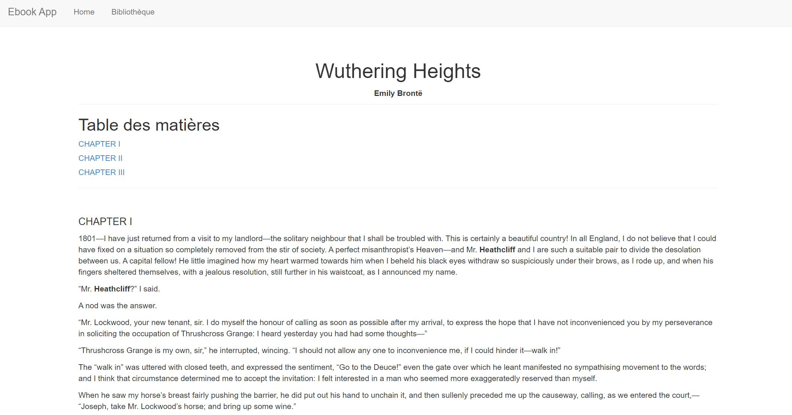
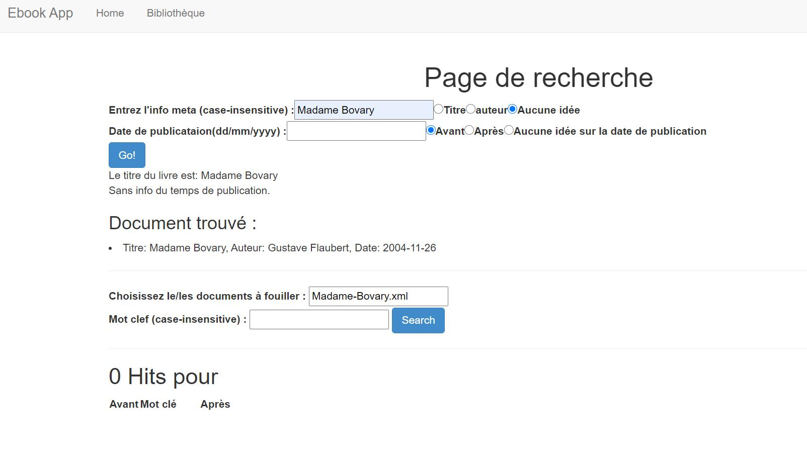
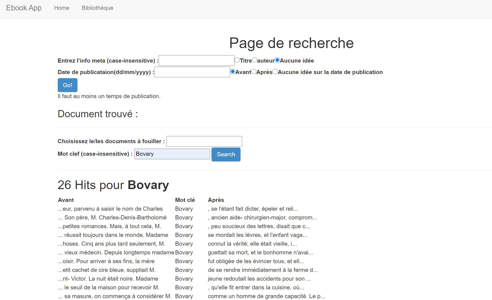

# projet-documents-structures

## Présentation du projet 
Dans le projet, j'essaie de construire un web app exist-db à partir des fichiers odt. (Il a 3 extraits d'exemples : Madame Bovary, Siddhartha et Wuthering-Heights.)

Selon la mise en forme et les métadonnées stockés dans fichiers odt, en utilisant XSLT, 3 fichiers XML sont construits en respectant l'encadrement du TEI. Ensuite, par Xquery et le logiciel exist-db, un e-book contenant ces 3 extraits est construit.)

Cette web application explique la démarche de ce projet, met en forme les fichiers xml, et permet d'effectuer un recherche plein texte dans le texte.

## Illustration de l'app final

### Page d'acceuil

### Affichage du texte

### Page de recherche

**recherche selon métadonnées**

**recherche selon métadonnées**

## Info sur les fichiers
L'application zippé est `ebook-0.1.xar` , la version dézippée est `tei-editoriale`, dans laquelle, les pages html sont stockées sous `pages`, les fichiers xslt pour transformer les fichiers xml sont dans `resources/xslt`

Le répertoire `transformation` contient les fichiers odt initials, la version xml de ces fichiers dans `output`, j'ai aussi mis le contenu de la page index dans ce répertoire (qui explique précisément la réalisation du projet). Et les fichiers rng pour valider ces fichiers xml sont dans `schema` (`index.rng` pour `index.xml`, `tei_minimal.rng` pour ceux qui sont produits par fichier odt)
